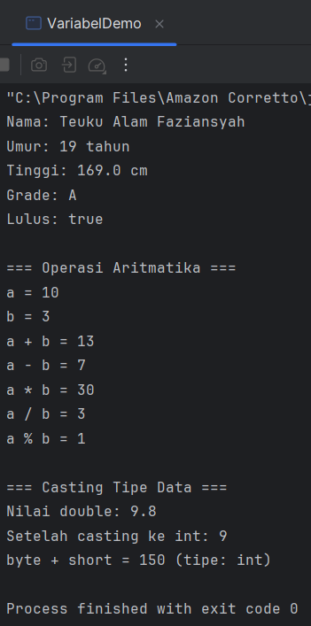

# Laporan Modul 2: Dasar Pemrograman Java
**Mata Kuliah:** Praktikum Pemrograman Berorientasi Objek   
**Nama:** Teuku Alam Faziansyah 
**NIM:** 2024573010068  
**Kelas:** TI 2A
---

## 1. Abstrak

Laporan ini berisi hasil praktikum mengenai dasar pemrograman menggunakan bahasa **Java**, yang meliputi penggunaan variabel, tipe data, operasi dasar, input-output, serta penerapan struktur kontrol seperti **percabangan** dan **perulangan**. Tujuan utama praktikum adalah agar mahasiswa memahami bagaimana logika program terbentuk, bagaimana data diproses, dan bagaimana keputusan atau pengulangan dibuat berdasarkan kondisi tertentu. Dari hasil percobaan, dapat disimpulkan bahwa penguasaan konsep dasar ini sangat penting sebagai fondasi sebelum mempelajari konsep **Object-Oriented Programming (OOP)** di Java.
**Kata kunci:** Java, struktur kontrol, perulangan, percabangan, pemrograman dasar.

---
## 2. Praktikum
### Praktikum 1 - Variabel dan Tipe Data
#### Dasar Teori
Dalam Java, tipe data digunakan untuk menentukan jenis nilai yang dapat disimpan dalam variabel. Secara umum, tipe data dibagi menjadi dua kategori utama, yaitu **tipe data primitif** dan **tipe data referensi**.

**Tipe Data Primitif:** terdiri atas delapan jenis, yaitu:
- `byte`: bilangan bulat 8-bit bertanda (-128 s.d. 127)
- `short`: bilangan bulat 16-bit (-32.768 s.d. 32.767)
- `int`: bilangan bulat 32-bit (-2.147.483.648 s.d. 2.147.483.647)
- `long`: bilangan bulat 64-bit
- `float`: bilangan pecahan 32-bit
- `double`: bilangan pecahan 64-bit
- `boolean`: hanya bernilai `true` atau `false`
- `char`: karakter Unicode 16-bit

**Tipe Data Referensi:** seperti `String`, `Array`, dan `Object` yang digunakan untuk menyimpan kumpulan atau objek kompleks.

**Aturan Penamaan Variabel:**
- Harus diawali dengan huruf, underscore (`_`), atau tanda dollar (`$`)
- Tidak boleh dimulai dengan angka
- Bersifat **case-sensitive** (huruf besar dan kecil dianggap berbeda)
- Tidak boleh menggunakan **keyword Java**

#### Analisa dan Pembahasan
Program `VariableDemo` mendemonstrasikan penggunaan berbagai tipe data, operasi aritmatika, dan proses konversi tipe data (casting). Variabel bertipe dasar seperti `int`, `double`, `char`, `boolean`, dan `String` digunakan untuk menampilkan nilai dan melakukan operasi matematika sederhana. Selain itu, program memperlihatkan **type casting** dari `double` ke `int` dan **automatic promotion** ketika operasi dilakukan antar tipe data berbeda. Program ini membantu mahasiswa memahami bagaimana Java mengelola data numerik dan teks, serta pentingnya tipe data dalam pengolahan informasi.

#### Langkah Praktikum
1. Buat file baru dengan nama VariabelDemo.java
2. ketik kode berikut
    
package modul_2;

public class VariableDemo {     
public static void main(String[] args) {    
// Deklarasi dan inisialisasi variabel  
int umur = 20;  
double tinggi = 175.5;  
char grade ='A';    
boolean lulus = true;   
String nama = "John Doe";

        //menampilkan nilai variabel
        System.out.println("Nama: " + nama);
        System.out.println("Umur: " + umur + "tahun");
        System.out.println("Tinggi: " + tinggi + "cm");
        System.out.println("Grade: " + grade);
        System.out.println("Lulus: " + lulus);

        int a = 10;
        int b = 3;

        System.out.println("\n Operasi Aritmatika ");
        System.out.println("a = " + a);
        System.out.println("b = " + b);
        System.out.println("a + b = " + (a + b));
        System.out.println("a - b = " + (a - b));
        System.out.println("a * b = " + (a * b));
        System.out.println("a / b = " + (a / b));
        System.out.println("a % b = " + (a % b));

        System.out.println("\n Casting Tipe Data");
        double nilaiDouble = 9.8;
        int nilaiInt = (int) nilaiDouble;

        System.out.println("Nilai double: " + nilaiDouble);
        System.out.println("Setelah casting ke int: " + nilaiInt);

        //Automatic promotion
        byte byteVar = 50;
        short shortVar = 100;
        int hasil = byteVar + shortVar;
        System.out.println("byte + short = " + hasil + "(tipe: int)");

    }
}
#### Screenshoot Hasil



#### Analisa dan Pembahasan
Analisa     
Program `VariableDemo` berfungsi untuk memperlihatkan bagaimana **variabel dan tipe data** digunakan dalam Java, serta bagaimana **operasi aritmatika dan konversi tipe data** dilakukan.  
Beberapa variabel dideklarasikan dengan tipe data berbeda seperti `int`, `double`, `char`, `boolean`, dan `String`.  
Bagian berikutnya menunjukkan operasi aritmatika dasar antara dua variabel (`a` dan `b`), lalu hasilnya ditampilkan di layar.  
Program juga menampilkan proses **type casting** dari `double` ke `int` yang menyebabkan nilai desimal dihilangkan, dan contoh **automatic type promotion** di mana hasil penjumlahan `byte` dan `short` secara otomatis dikonversi menjadi `int`.

Pembahasan  
Secara keseluruhan, program ini menggambarkan dasar pengelolaan data di Java.  
Melalui contoh yang sederhana, kita bisa melihat:
- Cara mendeklarasikan dan menginisialisasi variabel.
- Penggunaan operasi aritmatika untuk perhitungan sederhana.
- Proses konversi tipe data, baik manual (casting) maupun otomatis (promotion).

---

### Praktikum 2 - Input, Output, dan Scanner
#### Dasar Teori
Pada bahasa pemrograman **Java**, proses **input dan output** digunakan untuk berinteraksi dengan pengguna.  
**Input** berarti menerima data dari pengguna, sedangkan **output** berarti menampilkan informasi ke layar.

Untuk menerima input dari pengguna, Java menyediakan **kelas `Scanner`** yang berada dalam paket `java.util`.  
Kelas ini memungkinkan program membaca berbagai jenis data seperti **string, integer, double, dan boolean** langsung dari keyboard.

Agar dapat menggunakan `Scanner`, programmer harus menuliskan perintah:
> import java.util.Scanner;

Kemudian dibuat objek:
> Scanner input = new Scanner(System.in);

Beberapa metode umum yang digunakan:
- `nextLine()` → membaca teks (String)
- `nextInt()` → membaca bilangan bulat
- `nextDouble()` → membaca bilangan desimal
- `nextBoolean()` → membaca nilai true/false

Setelah selesai digunakan, objek `Scanner` sebaiknya ditutup dengan:
> input.close();

Dengan menggunakan **Scanner**, programmer dapat membuat program yang **interaktif dan dinamis**, karena pengguna bisa memberikan masukan langsung melalui terminal.

#### Langkah Praktikum
1. Buat file baru dengan nama InputOutputDemo.java
2. Ketik kode berikut:
```
package modul_2;

import java.util.Scanner;

public class InputOutputDemo {
    public static void main(String[] args) {
        // Membuat objek Sacnner
        Scanner input = new Scanner(System.in);
        // Membaca input string
        System.out.print("Masukkan nama Anda: ");
        String nama = input.nextLine();

        // Membaca input integer
        System.out.print("Masukkan umur Anda: ");
        int umur = input.nextInt();

        // Membaca iput double
        System.out.print("Masukkan tinggi Anda (cm): ");
        double tinggi = input.nextDouble();

        // Menampilkan output
        System.out.println("\n DATA ANDA");
        System.out.println("Nama: " + nama);
        System.out.println("Umur: " + umur + "tahun");
        System.out.println("Tingi: " + tinggi + "cm");

        // Menutup Scanner
        input.close();
    }
}
```
#### Screenshoot Hasil


#### Analisa dan Pembahasan
Program `InputOutputDemo` menunjukkan cara program membaca data dari pengguna dan menampilkannya kembali. Mahasiswa mempelajari bagaimana Scanner memproses input berdasarkan tipe data yang sesuai, serta bagaimana mengatur format output agar lebih informatif. Konsep ini sangat penting dalam membuat program yang **interaktif dan responsif** terhadap pengguna. Kesalahan tipe input juga dapat diantisipasi dengan memahami metode Scanner yang sesuai dengan tipe data yang diminta.

---

### Praktikum 3 - Struktur Kontrol: Percabangan
#### Dasar Teori
Struktur kontrol **percabangan (branching)** digunakan untuk menentukan alur logika program berdasarkan kondisi tertentu. Percabangan memungkinkan program untuk mengambil keputusan sesuai nilai atau kondisi yang diberikan. Jenis percabangan di Java meliputi:

1. **If-Else**: mengevaluasi kondisi logika untuk menentukan blok kode mana yang akan dijalankan.
2. **If-Else If-Else**: digunakan saat ada beberapa kondisi yang perlu diuji secara berurutan.
3. **Switch-Case**: digunakan ketika terdapat banyak pilihan berbasis nilai tertentu, sehingga program menjadi lebih terstruktur dan mudah dibaca.
4. **Nested If**: digunakan ketika terdapat kondisi di dalam kondisi lain (bersarang) untuk pemeriksaan lebih detail.

Struktur ini membantu program menjadi **dinamis dan adaptif** terhadap berbagai masukan dari pengguna.

#### Langkah Praktikum
langkah 1: Program penentu grade
1. Buat file baru dengan nama GradeDemo.java
2. isi dengan kode berikut:
```
package modul_2;

import java.util.Scanner;

public class GradeDemo {
    public static void main(String[] args) {
        Scanner input = new Scanner(System.in);

        System.out.print("Masukkan nilai (0-100): ");
        int nilai = input.nextInt();

        char grade;
        String keterangan;

        // Menggunakan if-else if-else
        if (nilai > 85) {
            grade = 'A';
            keterangan = "Excellent";
        } else if (nilai > 75) {
            grade = 'B';
            keterangan = "Good";
        } else if (nilai > 65) {
            grade = 'C';
            keterangan = "Fair";
        } else if (nilai > 55) {
            grade = 'D';
            keterangan = "Poor";
        } else {
            grade = 'E';
            keterangan = "Fail";
        }

        System.out.println("Nilai: " + nilai);
        System.out.println("Grade: " + grade);
        System.out.println("Keterangan: " + keterangan);

        input.close();
    }
}
```
#### Screenshoot Hasil


langkah 2: Program menu dengan switch
1. Buat file baru dengan nama MenuDemo.java
2. Implementasikan kode berikut:
```java
package modul_2;

import java.util.Scanner;

public class MenuDemo {
    public static void main(String[] args) {
        Scanner input = new Scanner(System.in);

        System.out.println("\n=== MENU PILIHAN ===");
        System.out.println("1. Hitung Luas Persegi");
        System.out.println("2. Hitung Luas Lingkaran");
        System.out.println("3. Hitung Luas Segitiga");
        System.out.println("4. Keluar");

        System.out.print("Pilih menu (1-4): ");
        int pilihan = input.nextInt();

        switch(pilihan) {
            case 1:
                System.out.print("Masukkan sisi persegi: ");
                double sisi = input.nextDouble();
                double LuasPersegi = sisi * sisi;
                System.out.println("Luas persegi: " + LuasPersegi);
                break;

            case 2:
                System.out.print("Masukkan jari-jari lingkaran: ");
                double jarijari = input.nextDouble();
                double luasLingkaran = Math.PI * jarijari * jarijari;
                System.out.println("Luas lingkaran: " + luasLingkaran);
                break;

            case 3:
                System.out.print("Masukkan alas segitiga: ");
                double alas = input.nextDouble();
                System.out.print("Masukkan tinggi segitiga: ");
                double tinggi = input.nextDouble();
                double LuasSegitiga = 0.5 * alas * tinggi;
                System.out.println("Luas segitiga: " + LuasSegitiga);
                break;

            case 4:
                System.out.println("Terima kasih!");
                break;

            default:
                System.out.println("Pilihan tidak valid");
        }

        input.close();
    }
}
```
#### Screenshot hasil

Langkah 3: Program Nested If
1. Buat file baru dengan nama NestedIfDemo.java
2. Implementasikan program untuk menentukan kategori usia:
```java
package modul_2;

import java.util.Scanner;

public class NestedIfDemo {
    public static void main(String[] args) {
        Scanner input = new Scanner(System.in);

        System.out.print("Masukkan umur: ");
        int umur = input.nextInt();

        if (umur >= 0) {
            if (umur <= 2) {
                System.out.println("Kategori: Bayi");
            } else if (umur <= 5) {
                System.out.println("Kategori: Balita");
            } else if (umur <= 12) {
                System.out.println("Kategori: Anak-anak");
            } else if (umur <= 19) {
                System.out.println("Kategori: Remaja");
            } else if (umur <= 59) {
                System.out.println("Kategori: Dewasa");
            } else {
                System.out.println("Kategori: Lansia");
            }
        } else {
            System.out.println("Umur tidak valid!");
        }

        input.close();
    }
}
```
#### Screenshot hasil

#### Analisa dan Pembahasan
#### Analisa dan Pembahasan
Dalam `GradeDemo.java`, percabangan **if-else if-else** digunakan untuk menentukan nilai huruf dan keterangan berdasarkan skor. `MenuDemo.java` menerapkan struktur **switch-case** untuk memproses beberapa pilihan perhitungan luas bangun datar. Sedangkan `NestedIfDemo.java` menggunakan **if bersarang** untuk menentukan kategori umur berdasarkan rentang nilai tertentu. Melalui ketiga contoh tersebut, mahasiswa memahami bagaimana percabangan memengaruhi alur eksekusi program dan bagaimana setiap kondisi dikendalikan agar program menghasilkan keluaran yang sesuai.
#### Program 1: GradeDemo.java

#### Analisa
Program `GradeDemo` digunakan untuk menentukan **grade** berdasarkan nilai yang dimasukkan oleh pengguna.  
Program menggunakan **struktur kontrol if-else if-else** untuk mengevaluasi kondisi nilai dan menetapkan huruf grade (`A`–`E`) beserta keterangan yang sesuai.  
Nilai lebih dari 85 mendapat `A`, sedangkan nilai di bawah 55 mendapat `E`. Program ini juga memanfaatkan kelas `Scanner` untuk membaca input dari pengguna.

#### Pembahasan
Konsep utama dari program ini adalah **percabangan bersyarat**.  
Java akan mengevaluasi kondisi dari atas ke bawah hingga menemukan kondisi yang benar, lalu menjalankan blok kode yang sesuai.  
Dengan logika if-else yang tersusun rapi, program mampu menentukan hasil akhir dengan efisien.  
Penggunaan `Scanner` menambah interaktivitas karena pengguna dapat memasukkan nilai secara langsung.

---

#### Program 2: MenuDemo.java

#### Analisa
Program `MenuDemo` menampilkan **menu pilihan** yang terdiri dari beberapa opsi untuk menghitung luas bangun datar (persegi, lingkaran, dan segitiga).  
Program memanfaatkan **struktur kontrol switch-case** untuk mengeksekusi perintah berdasarkan angka menu yang dimasukkan pengguna.  
Setiap case berisi rumus perhitungan berbeda, dan `default` digunakan untuk menangani input yang tidak valid.

#### Pembahasan
Struktur **switch-case** digunakan agar program lebih terstruktur dan mudah dibaca dibandingkan menggunakan if-else berulang.  
Setiap pilihan dihubungkan langsung dengan proses perhitungan yang relevan:
- Persegi → sisi × sisi
- Lingkaran → π × r²
- Segitiga → ½ × alas × tinggi

Program ini menunjukkan penerapan percabangan multi-cabang dengan efisien, serta menampilkan hasil perhitungan yang interaktif sesuai pilihan pengguna.

---

#### Program 3: NestedIfDemo.java

#### Analisa
Program `NestedIfDemo` digunakan untuk menentukan **kategori usia** berdasarkan input umur dari pengguna.  
Struktur yang digunakan adalah **nested if** (percabangan bersarang), di mana satu kondisi `if` berada di dalam kondisi `if` lainnya.  
Jika umur valid (lebih dari atau sama dengan 0), maka akan diperiksa rentang umur dan dikategorikan menjadi “Bayi”, “Balita”, “Anak-anak”, “Remaja”, “Dewasa”, atau “Lansia”.

#### Pembahasan
Penggunaan **nested if** memungkinkan program melakukan pengecekan berlapis.  
Langkah pertama adalah memastikan umur valid, lalu barulah dilakukan pengecekan kategori umur berdasarkan rentang nilai.  
Struktur ini cocok digunakan untuk kasus yang membutuhkan logika bertingkat dan saling bergantung antar kondisi.  
Hasil akhirnya adalah kategori usia yang tampil sesuai umur yang diinput oleh pengguna.

---

### Praktikum 4 - Struktur Kontrol: Perulangan
#### Dasar Teori
Struktur kontrol **perulangan (looping)** digunakan untuk mengeksekusi satu atau beberapa perintah secara berulang hingga kondisi tertentu tidak lagi terpenuhi. Java menyediakan beberapa jenis perulangan, yaitu:

1. **For Loop** – digunakan ketika jumlah iterasi sudah diketahui.
2. **While Loop** – digunakan ketika jumlah iterasi belum pasti dan tergantung pada kondisi.
3. **Do-While Loop** – mirip dengan while, tetapi blok kode dieksekusi minimal satu kali sebelum kondisi diperiksa.
4. **Nested Loop** – perulangan di dalam perulangan, sering digunakan untuk mencetak pola atau mengolah data dua dimensi.

Dengan struktur ini, proses yang berulang dapat dilakukan secara efisien tanpa harus menulis kode yang sama berkali-kali.

#### Langkah Praktikum
Langkah 1: Perulangan For
1. Buat file baru dengan nama ForLoopDemo.java
2. Implementasikan berbagai contoh for loop:
```
package modul_2;
//Langkah 1: Perulangan For

public class ForLoopDemo {
    public static void main(String[] args) {
        //Contoh 1: Menampilkan angka 1-10
        System.out.println("=== Angka 1-10 ===");
        for (int i = 1; i <= 10; i++) {
            System.out.print(i + " ");
        }
        System.out.println();

        //Contoh 2: Menampilkan angka genap
        System.out.println("=== Angka genap 2-20 ===");
        for (int i = 2; i <= 20; i += 2) {
            System.out.print(i + " ");
        }
        System.out.println();

        //Contoh 3: Countdown
        System.out.println("=== Countdown ===");
        for (int i = 10; i >= 1; i--) {
            System.out.print(i + " ");
        }
        System.out.println("Start!");

        //Contoh 4: Tabel perkalian
        System.out.println("=== Tabel perkalian 5 ===");
        for (int i = 1; i <= 10; i++) {
            System.out.print("5 x " + i + " = " + (5 * i));
        }
    }
}
```
#### Screenshoot Hasil


Langkah 2: Perulangan While dan Do-While
1. Buat file baru dengan nama WhileLoopDemo.java
2. Implementasikan contoh while dan do-while:
```
package modul_2;

import java.util.Scanner;

public class WhileLoopDemo {
    public static void main(String[] args){
        Scanner input = new Scanner(System.in);

        // Contoh While Loop
        System.out.println("=== While Loop - Tebak Angka ===");
        int angkaRahasia = 7;
        int tebakan = 0;

        while (tebakan != angkaRahasia) {
            System.out.print("Tebak angka (1-10): ");
            tebakan = input.nextInt();

            if (tebakan < angkaRahasia) {
                System.out.println("Terlalu kecil!");
            } else if (tebakan > angkaRahasia) {
                System.out.println("Terlalu besar!");
            } else {
                System.out.println("Benar! Angka rahasianya adalah " + angkaRahasia);
                }
            }

        // Contoh Do-While Loop
        System.out.println("\n=== Do-While Loop - Menu ===");
        int pilihan;

        do {
            System.out.println("\n1. Tampilkan pesan");
            System.out.println("2. Hitung faktorial");
            System.out.println("3. Keluar");
            System.out.print("Pilih menu: ");
            pilihan = input.nextInt();

            switch (pilihan) {
                case 1:
                    System.out.println("Hello, World!");
                    break;
                    case 2:
                        System.out.print("Masukkan angka: ");
                        int n = input.nextInt();
                        long faktorial = 1;
                        for (int i = 1; i <= n; i++) {
                            faktorial *= i;
                        }
                        System.out.println("Faktorial " + n + " = " + faktorial);
                        break;
                    case 3:
                        System.out.println("Terima kasih!");
                        break;
                    default:
                        System.out.println("Pilihan tidak valid!");
                }
            } while (pilihan != 3);

            input.close();
        }
}
```
#### Screenshoot Hasil

Langkah 3: Nested Loop (Perulangan Bersarang)
1. Buat file baru dengan nama NestedLoopDemo.java
2. Implementasikan contoh nested loop:
```
package modul_2;

public class NestedLoopDemo {
    public static void main(String[] args) {
        // Contoh 1: Pola Bintang
        System.out.println("=== Pola Bintang Segitiga ===");
        for (int i = 1; i <= 5; i++) {
            for (int j = 1; j < i; j++) {
                System.out.print("* ");
            }
            System.out.println();
        }

        // Contoh 2: Tabel Perkalian
        System.out.println("\n=== Tabel Perkalian 1-5 ===");
        for (int i = 1; i <= 5; i++) {
            for (int j = 1; j <= 5; j++) {
                System.out.printf("%3d ", (i * j));
            }
            System.out.println();
        }

        // Contoh 3: Pola Angka
        System.out.println("\n=== Pola Angka ===");
        for (int i = 1; i <= 4; i++) {
            for (int j = 1; j <= i; j++) {
                System.out.print(j + " ");
            }
            System.out.println();
        }
    }
}
```
#### Screenshot hasil

#### Analisa dan Pembahasan

#### Program 1: ForLoopDemo.java

#### Analisa
Program `ForLoopDemo` menunjukkan berbagai contoh penggunaan **perulangan for**.  
Setiap bagian menampilkan fungsi berbeda:
1. **Menampilkan angka 1–10** dengan kenaikan variabel `i`.
2. **Menampilkan angka genap 2–20** dengan langkah `i += 2`.
3. **Countdown** dari 10 ke 1 menggunakan decrement `i--`.
4. **Tabel perkalian 5** yang menghitung hasil `5 × i` untuk setiap iterasi.

Semua contoh menggunakan pola umum `for(inisialisasi; kondisi; perubahan)` yang membuat pengulangan berjalan terkontrol.

#### Pembahasan
Struktur `for` sangat cocok digunakan ketika jumlah perulangan sudah diketahui.  
Program ini memperlihatkan bagaimana variabel kontrol `i` dapat disesuaikan untuk:
- Menambah nilai secara bertahap (increment)
- Mengurangi nilai (decrement)
- Melakukan perhitungan berulang seperti tabel perkalian

Dengan contoh ini, pengguna dapat memahami bahwa **for loop** fleksibel untuk berbagai pola perulangan sederhana maupun menengah.

---

#### Program 2: WhileLoopDemo.java

#### Analisa
Program `WhileLoopDemo` terdiri dari dua bagian:
1. **While loop – Tebak Angka:** pengguna diminta menebak angka rahasia (7). Perulangan terus berjalan sampai tebakan benar.
2. **Do-while loop – Menu interaktif:** menampilkan menu pilihan berulang kali hingga pengguna memilih keluar (opsi 3).  
   Dalam menu, terdapat juga contoh perhitungan **faktorial** menggunakan for loop di dalam do-while.

#### Pembahasan
Perbedaan utama antara `while` dan `do-while` ditunjukkan dengan jelas:
- `while` → kondisi dicek **sebelum** perulangan dimulai.
- `do-while` → perulangan dijalankan **minimal satu kali**, baru kemudian kondisi dicek.

Program ini menggambarkan bahwa:
- `while` cocok untuk proses yang bergantung pada kondisi awal.
- `do-while` cocok untuk menu interaktif yang harus dijalankan minimal sekali.  
  Kombinasi keduanya memperlihatkan fleksibilitas kontrol perulangan dalam situasi berbeda.

---

#### Program 3: NestedLoopDemo.java

#### Analisa
Program `NestedLoopDemo` memperlihatkan penggunaan **perulangan bersarang (nested loop)** untuk mencetak pola.  
Terdapat tiga contoh utama:
1. **Pola bintang segitiga**, menggunakan dua loop bersarang di mana loop dalam mencetak bintang sesuai nilai baris.
2. **Tabel perkalian 1–5**, menampilkan hasil perkalian dua variabel loop (`i × j`) dengan format teratur.
3. **Pola angka bertingkat**, menampilkan deretan angka bertambah pada setiap baris.

#### Pembahasan
Nested loop digunakan ketika satu proses perulangan bergantung pada hasil dari perulangan lain.  
Setiap lapisan loop mewakili dimensi atau level berbeda — misalnya, baris dan kolom dalam tabel.  
Program ini menunjukkan:
- Penggunaan loop bersarang untuk membentuk **pola visual (bintang dan angka)**
- Cara mencetak **tabel terstruktur** dengan hasil perkalian

Dari contoh ini, dapat dipahami bahwa **nested loop** sangat berguna dalam kasus yang memerlukan iterasi dua arah atau tampilan data berbentuk matriks.

---

## 3. Kesimpulan
Dari keempat praktikum yang telah dilakukan, diperoleh kesimpulan sebagai berikut:

1. **Variabel dan Tipe Data** – memahami cara mendeklarasikan, menginisialisasi, dan menggunakan berbagai tipe data di Java.
2. **Input dan Output (Scanner)** – mampu menggunakan kelas `Scanner` untuk menerima input dari pengguna dan menampilkan hasil dengan format yang baik.
3. **Struktur Kontrol Percabangan** – memahami bagaimana program mengambil keputusan menggunakan struktur `if`, `if-else`, `switch`, dan `nested if` untuk mengatur alur logika program.
4. **Struktur Kontrol Perulangan** – mempelajari berbagai bentuk perulangan (`for`, `while`, `do-while`, dan nested loop`) untuk menyelesaikan permasalahan yang membutuhkan proses berulang.

Keseluruhan praktikum memberikan pemahaman dasar yang kuat dalam menyusun logika pemrograman Java. Pengetahuan ini menjadi landasan penting untuk mempelajari konsep lanjutan seperti **pemrograman berorientasi objek (OOP)**, pengolahan data, dan pengembangan aplikasi berbasis Java.

---

## 4. Referensi
- Oracle. (2024). *The Java™ Tutorials: Variables and Data Types*. Diakses dari: [https://docs.oracle.com/javase/tutorial/java/nutsandbolts/variables.html](https://docs.oracle.com/javase/tutorial/java/nutsandbolts/variables.html)
- W3Schools. (2024). *Java User Input (Scanner)*. Diakses dari: [https://www.w3schools.com/java/java_user_input.asp](https://www.w3schools.com/java/java_user_input.asp)
- GeeksforGeeks. (2024). *Java Control Statements (Decision Making and Looping)*. Diakses dari: [https://www.geeksforgeeks.org/java-control-statements-decision-making-and-looping](https://www.geeksforgeeks.org/java-control-statements-decision-making-and-looping)

---
